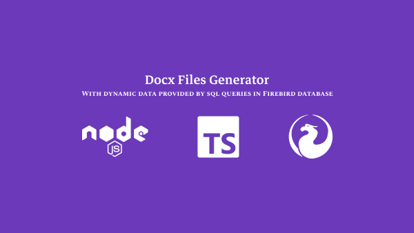

# DOCX File Generator from Firebird Database


An application developed in Node.js and TypeScript to generate DOCX files containing dynamic company data such as CNPJ, business name, address, and other details.

## Screenshots



## Features

- Generates customized DOCX files for each company from the Firebird database.
- Includes information like CNPJ, business name, address, and other relevant details.
- Facilitates the generation of authorizations for using company data and logos on a software provider's website.

## Getting Started

1. Clone the repository:
   ```sh
   git clone https://github.com/ageurdo/docx-files-generator-node-and-firebird.git
   ```

2. Navigate to the project directory:
   ```sh
   cd docx-files-generator-node-and-firebird
   ```

3. Create a .env file based on the .env.sample file and fill in the Firebird database connection information.

4. Install dependencies:
    ```sh
    yarn install
    # or
    npm install
    ```

5. Start the development server:
    ```sh
    yarn dev
    ```

Note: Output Files - After running the project, the generated files will be saved in the ./output folder.